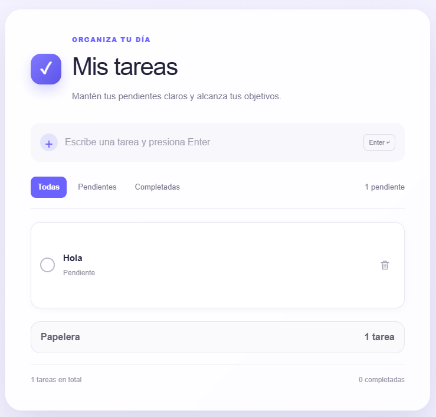
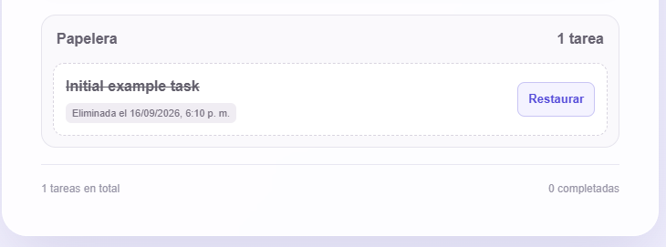

# 🚀 BPDS - Todo App


Aplicación web moderna e intuitiva para la gestión eficiente de tareas (*Todo List*), desarrollada como proyecto práctico dentro de la asignatura **Buenas Prácticas de Desarrollo de Software (BPDS)**.

---

## 📸 Vista Previa de la Aplicación

> *Añade aquí las imágenes de tu proyecto guardadas en la carpeta `public/` o subidas a GitHub.*

| Vista Principal (Tareas Activas) | Nueva Funcionalidad: Papelera de Reciclaje |
| :---: | :---: |
|  |  |

---

## ✨ Funcionalidades Principales

* 📝 **Gestión de Tareas (CRUD completo):**
  * **Crear:** Añade rápidamente nuevas tareas a tu lista.
  * **Consultar:** Visualiza tus tareas de forma clara y ordenada.
  * **Actualizar:** Modifica el título o contenido de tus tareas existentes.
  * **Completar:** Marca y desmarca tareas según tu progreso.
* 🗑️ **Nueva Papelera (Soft Delete):**
  * Las tareas eliminadas no se destruyen permanentemente de inmediato; se mueven a la papelera.
  * **Restauración:** Recupera tareas eliminadas por error con un solo clic.
  * **Vaciado / Eliminación definitiva:** Limpia la papelera para eliminar permanentemente los registros.
* 📅 **Ordenamiento automático:** Filtra y organiza las tareas por fecha de creación o estado de realización.

---

## 🛠️ Tecnologías Utilizadas

* **Framework:** [Next.js](https://nextjs.org/) (App Router & Server Actions)
* **Lenguaje:** [TypeScript](https://www.typescriptlang.org/)
* **Biblioteca UI:** [React](https://react.dev/)
* **Entorno de ejecución:** [Node.js](https://nodejs.org/)
* **Gestor de paquetes:** [npm](https://www.npmjs.com/)
* **Control de versiones:** [Git](https://git-scm.com/) & [GitHub](https://github.com/)

---

## 💻 Requisitos Previos

Asegúrate de contar con las siguientes herramientas instaladas en tu equipo antes de continuar:

* **Node.js** (`v18.x` o superior)
* **npm** (`v9.x` o superior)
* **Git**

Verifica la instalación ejecutando en tu terminal:

```bash
node --version
npm --version
git --version
```

---

## 🚀 Guía de Instalación y Configuración Local

Sigue estos pasos para ejecutar el proyecto en tu entorno local:

### 1. Clonar el repositorio

```bash
git clone https://github.com/CamiloMaduro/BPDS.git
cd BPDS
```

### 2. Instalar las dependencias

Ejecuta el siguiente comando para descargar todos los módulos necesarios:

```bash
npm install
```

### 3. Ejecutar el entorno de desarrollo

Inicia el servidor de desarrollo local:

```bash
npm run dev
```

### 4. Abrir en el navegador

Visita en tu navegador web la siguiente dirección:
👉 http://localhost:3000

---

## 👥 Integrantes del Equipo

Proyecto desarrollado por:

* 👤 **Camilo Maduro** - Desarrollador / Liderazgo - [@CamiloMaduro](https://github.com/CamiloMaduro)
* 👤 Nombre del Integrante 2 - Desarrollador - [@usuario2](https://github.com/usuario2)
* 👤 Nombre del Integrante 3 - Desarrollador - [@usuario3](https://github.com/usuario3)

---

## 📁 Estructura del Proyecto

```
BPDS/
├── app/                  # Rutas, componentes e interfaces de Next.js
│   ├── actions/          # Server Actions (create, read, update, delete, trash)
│   ├── trash/            # Vista y lógica de la nueva papelera
│   ├── layout.tsx        # Layout global
│   └── page.tsx          # Página principal
├── lib/                  # Utilidades y funciones auxiliares (todos.ts)
├── public/               # Archivos estáticos e imágenes (screenshots)
├── todos.json            # Base de datos local en JSON
├── package.json          # Dependencias y scripts
├── tsconfig.json         # Configuración de TypeScript
└── README.md             # Documentación del proyecto
```

---

## 📊 Modelo de Datos

Cada elemento `Todo` sigue el siguiente esquema técnico:

```json
{
  "id": "1",
  "title": "Ejemplo de tarea inicial",
  "completed": false,
  "inTrash": false,
  "createdAt": "2024-06-01T12:00:00Z"
}
```

| Campo       | Tipo    | Descripción                                             |
|-------------|---------|----------------------------------------------------------|
| `id`        | string  | Identificador único de la tarea.                          |
| `title`     | string  | Título o descripción corta de la tarea.                   |
| `completed` | boolean | Indica si la tarea se ha marcado como completada.          |
| `inTrash`   | boolean | Indica si la tarea se encuentra actualmente en la papelera.|
| `createdAt` | string  | Fecha y hora en formato ISO de creación de la tarea.        |

---

## 🌿 Flujo de Trabajo y Git

Seguimos una estrategia de ramificación organizada basada en `dev` para la integración continua.

```
main
 │
 └── dev
      │
      ├── feature/todo-trash    <-- Nueva funcionalidad de papelera
      ├── feature/todo-ui
      └── fix/todo-created-at
```

### Convención de Commits

* `feat:` para nuevas funcionalidades (ej. `feat: add trash recovery option`).
* `fix:` para corrección de errores (ej. `fix: correct status filter behavior`).
* `refactor:` para mejoras de código que no cambian funcionalidad.
* `docs:` para cambios en la documentación.

---

## 🧹 Solución de Problemas Frecuentes

Si experimentas problemas con la caché o archivos temporales de Next.js, puedes realizar una limpieza ejecutando:

**En Linux / macOS:**

```bash
rm -rf .next
npm run dev
```

**En Windows (PowerShell):**

```powershell
Remove-Item -Recurse -Force .next
npm run dev
```

---

## 📄 Licencia

Este proyecto es de carácter académico y forma parte del plan de trabajo de la asignatura **Buenas Prácticas de Desarrollo de Software (BPDS)**.
